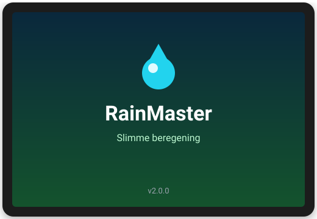
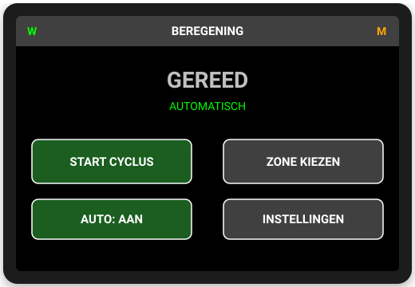
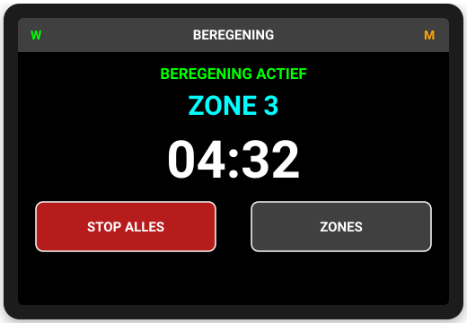
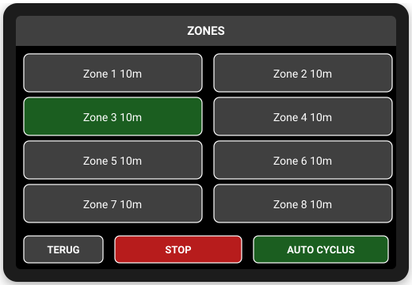
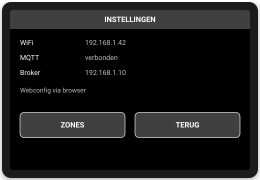

# RainMaster

RainMaster is een slimme beregeningscomputer op basis van een ESP32-S3
met een 4" touchscreen. Je bedient je beregeningszones rechtstreeks op
het scherm, en via Home Assistant koppel je de zone-commando's aan de
daadwerkelijke relais/kleppen in je installatie.

Er zijn twee volledig onafhankelijke implementaties in deze repository,
voor dezelfde hardware:
- **Custom firmware** (C++ / PlatformIO) — in de root van de repo.
- **ESPHome-variant** — in `esphome/`.

Kies wat het beste bij je past: de custom firmware geeft je volledige
controle en een kleine footprint; de ESPHome-variant is eenvoudiger te
onderhouden en integreert direct native met Home Assistant.

## Hardware
- **MCU:** ESP32-S3-WROOM-1U-N8R2 (8 MB flash, 2 MB quad-SPI PSRAM)
- **Display:** 4" ILI9488 SPI TFT, 8-pins module inclusief touch (XPT2046) en SD-kaartslot

## Functies
- Acht onafhankelijke beregeningszones, elk met een eigen looptijd
- Automatische cyclus die alle zones na elkaar doorloopt
- Handmatig een enkele zone starten/stoppen vanaf het touchscreen
- Live countdown van de resterende looptijd
- Home Assistant-integratie voor bediening en automatisering op afstand
- WiFi-fallback met een tijdelijk toegangspunt als er geen verbinding is
- OTA-firmware-updates

## Schermen

RainMaster heeft vier schermen: een opstartscherm, het startscherm (in
twee toestanden), zone-selectie en instellingen. De onderstaande
afbeeldingen zijn representatieve weergaves van de interface.

### Opstartscherm


Bij het inschakelen toont het scherm 2,5 seconden lang het RainMaster-logo
op een verloop van diep water-blauw naar fris groen — het beeldmerk voor
"water dat groei voedt".

### Startscherm — gereed


Toont de status (WiFi/Home Assistant-verbinding bovenin, automatische
modus aan/uit) en geeft toegang tot een volledige cyclus, losse zones,
het aan/uit zetten van de automatische modus en de instellingen.

### Startscherm — actief


Zodra een zone loopt zie je direct welke zone actief is en hoeveel tijd
er nog resteert. Met één druk op de knop stop je de volledige cyclus.

### Zone-overzicht


Alle acht zones op één scherm, met hun ingestelde looptijd. Tik op een
zone om die direct te starten; de actief lopende zone is gemarkeerd.

### Instellingen


Overzicht van de netwerkstatus. Looptijden en verbindingsinstellingen
wijzig je via de webconfiguratie (custom firmware) of via Home Assistant
(ESPHome-variant).

---

## Custom firmware (PlatformIO)

```
pio run
pio run -t upload
pio device monitor
```

De TFT_eSPI-configuratie (ILI9488, pinnen, fonts) staat als `build_flags`
in `platformio.ini`, in plaats van een `User_Setup.h` in de library.

**Pas de SPI-pinnen (`TFT_CS`, `TFT_DC`, `TFT_RST`, `TFT_MISO`, `TFT_MOSI`,
`TFT_SCLK`, `TOUCH_CS`, `SD_CS`) in `platformio.ini` aan naar je eigen
bedrading** — de huidige waarden zijn placeholders.

### Libraries
- TFT_eSPI
- PubSubClient
- ElegantOTA
- ESP32 Arduino core (WiFi, WebServer, Preferences, DNSServer)

### Webconfiguratie & OTA
De webconfiguratiepagina (WiFi/MQTT instellen, herstarten) en OTA-updates
(`/update`) zijn beveiligd met HTTP Basic Auth. Standaard inloggegevens
(`config.h`, `WEBUI_USER`/`WEBUI_PASS`): gebruiker `admin`, wachtwoord
`beregening123` — **wijzig dit wachtwoord voor je het apparaat op een
netwerk aansluit.**

### MQTT
Discovery wordt automatisch aangemaakt voor automatische modus, status,
actieve zone, resterende tijd, zone 1-8 en looptijden.

Commando's:
- `beregening/command/start` = `CYCLE` of `1`..`8`
- `beregening/command/stop` = willekeurige payload
- `beregening/command/auto` = `ON`/`OFF`
- `beregening/zone/1/command` = `ON`/`OFF`
- `beregening/zone/1/runtime/set` = seconden

Bij eerste start zonder opgeslagen WiFi: AP `RainMaster-xxxxxx`, wachtwoord `12345678`.

---

## ESPHome-variant

Alternatieve implementatie op basis van [ESPHome](https://esphome.io)
voor dezelfde hardware, in `esphome/beregeningscomputer.yaml`.

Belangrijkste verschillen met de custom firmware:
- **Home Assistant-integratie via de native ESPHome API** (automatische
  discovery van alle entiteiten), in plaats van handmatig samengestelde
  MQTT-discovery-topics. MQTT kan er desgewenst naast, maar zit niet in
  deze config.
- **Touchscreen-UI met LVGL**: dezelfde vier schermen als hierboven,
  met dezelfde natuurlijke opstart-animatie.
- Zone-looptijden stel je in via de `number`-entiteiten in Home Assistant.
- WiFi-fallback (AP + captive portal) komt standaard mee via ESPHome zelf.

### Bouwen/flashen
```
cd esphome
cp secrets.yaml.example secrets.yaml   # vul WiFi/OTA/API-gegevens in
esphome run beregeningscomputer.yaml
```

**Belangrijk vóór het flashen:**
- De SPI-pinnen in de `substitutions:`-sectie bovenaan
  `beregeningscomputer.yaml` (`pin_sclk`, `pin_mosi`, `pin_miso`,
  `pin_tft_cs`, `pin_tft_dc`, `pin_tft_rst`, `pin_touch_cs`, `pin_sd_cs`)
  zijn **placeholders** — pas ze aan naar je eigen bedrading.
- De touchkalibratie (`calibration:` onder `touchscreen:`) is een
  startwaarde; controleer/herijk aan de hand van de `x_raw`/`y_raw`-waarden
  die in de logs verschijnen bij het aanraken van het scherm (`on_touch:`),
  en pas zo nodig `calibration:` of `transform:` (swap_xy/mirror_x/mirror_y) aan.
- Kleuren kunnen omgedraaid ogen op sommige ILI9488-panelen; wissel dan
  `color_order: BGR` naar `RGB` in het `display:`-blok.

Dit is een uitgebreide, met zorg opgebouwde configuratie, maar **nog niet
getest op echte hardware** (er was geen ESPHome-toolchain beschikbaar in de
omgeving waarin dit is gemaakt). Controleer na de eerste `esphome compile`
de foutmeldingen — kleine schema-aanpassingen (bijv. exacte sleutelnamen
binnen `lvgl:`-acties) kunnen nodig zijn afhankelijk van je ESPHome-versie.
